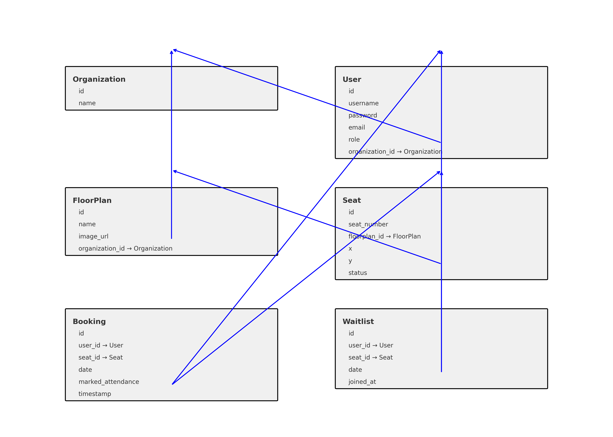

# Project Title

A brief description of what this project does and who it's for-

#  Hybrid Workplace Seat Booking System

A flexible **seat reservation and attendance system** for hybrid workplaces — built with **Django** (REST API backend) and **React** (frontend). Supports real-time seat booking, waitlisting, attendance marking, analytics, and multi-org (SaaS) architecture.

---

## Assumptions

-  Employees must book seats before visiting the office.
-  Floor plans and seat locations are pre-defined by **management**.
-  Employees can **view availability** on a given date via a floor plan UI.
-  Users must **mark attendance** on arrival — unmarked seats by 10:00 AM are freed.
-  Cancelled or no-show seats are **auto-assigned to waitlisted users**.
-  Multiple organizations can use the platform, each operating in its own namespace.

---

##  General Flow

###  Employee

1. **Login** → Token Auth
2. **View Floor Plan** → Clickable UI
3. **Book Seat** → If full, option to waitlist
4. **Mark Attendance** on arrival
5. **Cancel Booking** → Frees seat + auto-promotes waitlisted user

### Management

1. **Create Floor Plans / Seats**
2. **Book for Others or Maintenance**
3. **View Reports**:
   - Booked vs Attended
   - No-shows
   - Utilization % by floor
4. **Cancel Bookings / Free Seats**
5. **Handle Multiple Orgs** (SaaS context)

---

## ER Diagram


---

## Tech Stack

| Layer      | Tech                    |
|------------|-------------------------|
| Backend    | Django + DRF            |
| Frontend   | React + Axios           |
| DB         | MongoDB   |
| Auth       | Token-based             |
| Scheduling | Django Commands (or Celery) |
| Multi-Tenant | Org-based data isolation |

---

##  API Documentation

Interactive API documentation is available via **Swagger UI**.

### 🔗 Access Swagger

-  [Swagger UI](http://localhost:8000/swagger/)  

> Make sure your Django server is running locally at `http://localhost:8000`

---

###  API Features
- Test endpoints directly in the browser
- View all request/response formats
- Explore authentication-protected routes


##  Postman Collection
Postman collection for testing all available API endpoints.

### 🔗 Download Links
- 📄 [Postman Collection (JSON)](postman/Hybrid_Seat_Booking_FIXED.postman_collection.json)
- 📄 [Environment file (JSON)](postman/Hybrid_Seat_Booking_Environment.postman_environment.json)

###  How to Use It

1. Open [Postman](https://www.postman.com/downloads/).
2. Click **Import**.
3. Upload the downloaded collection JSON file.
4. Import the environment file if provided.
5. Set the required environment variables:
   - `base_url` → e.g., `http://localhost:8000`
   - `auth_token` → your JWT access token after login

Then you can directly test endpoints like:

- `POST /auth/login/`
- `POST /bookings/`
- `GET /bookings/my/`
- `POST /waitlist/join/`
- `GET /analytics/summary/`
- And many more...

---

**Note:** All secured endpoints require an `Authorization` header in the format:

```http
Authorization: Token {{auth_token}}


